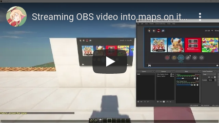

# MakiScreen
> 📺 Streaming OBS video into maps on item frames at a high frame rate

## How does it works

- Load jar plugin onto 1.17+ Paper server
- It will start a thread to listen for UDP packets on port 1337
- Use ffmpeg to send [OBS Virtual Camera](https://youtu.be/IvEZr8z5eu4) as JPG frames to the UDP socket
- Renders the latest available frame in Minecraft! 

## Get started (It's not easy and it's experimental)

**Beware that map ID 0 and 1 will probably be overwritten**

- Download [MakiScreen](https://github.com/makitsune/MakiScreen/releases/tag/1.0) jar and place in Spigot 1.13+ server plugins
- Download [FFmpeg](http://ffmpeg.org/download.html) and make sure its in your path
- Download [OBS](https://obsproject.com)
- Run **Paper** server and make sure port **1337 UDP** is available
- Run **OBS** and make sure the base resolution and output resolution is **512:256** or any resolution with 2:1 aspect ratio, and set the frame rate to **20**
- Enable **Tools>VirtualCam**
- Open terminal shell and enter `ffmpeg -y -f dshow -i video="OBS Virtual Camera" -vf scale=512:256 -f rawvideo -c:v mjpeg -q:v 31 -qscale:v 1 -r 20 udp://127.0.0.1:1337`
- Type `/maki` in Minecraft to get the maps

## Help me

You can contact me on **Discord** at [Maki#4845](https://maki.cat/discord) or on **Twitter** at [@MakiXx_](https://twitter.com/MakiXx_)
